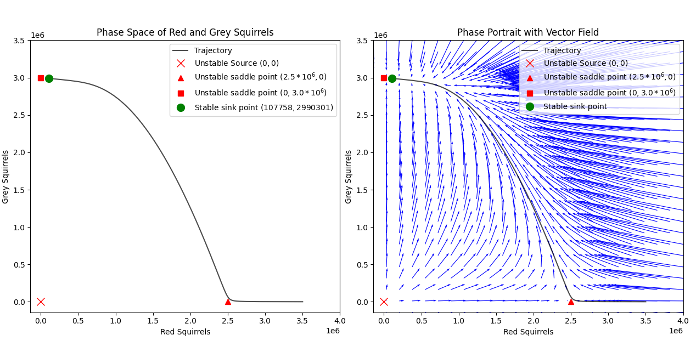
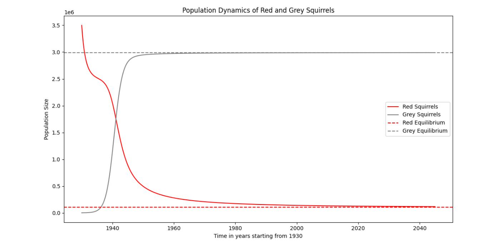
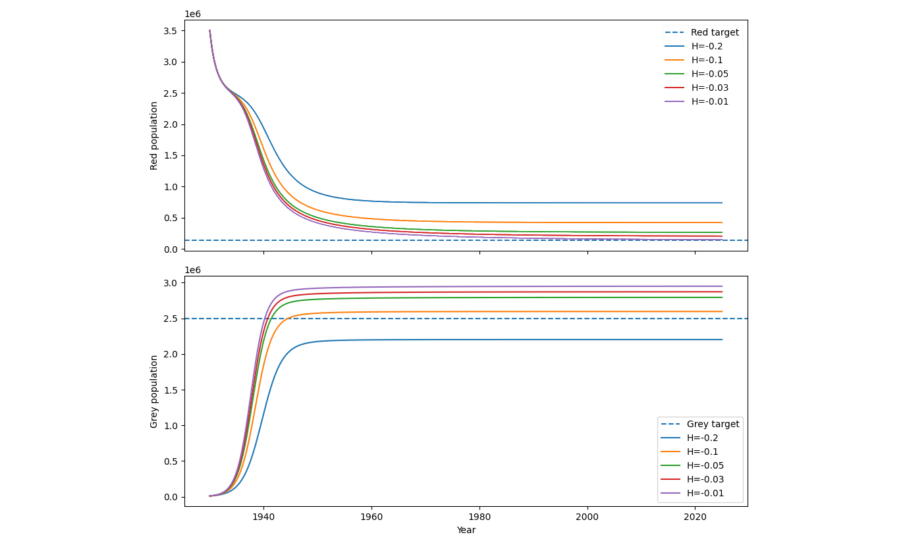
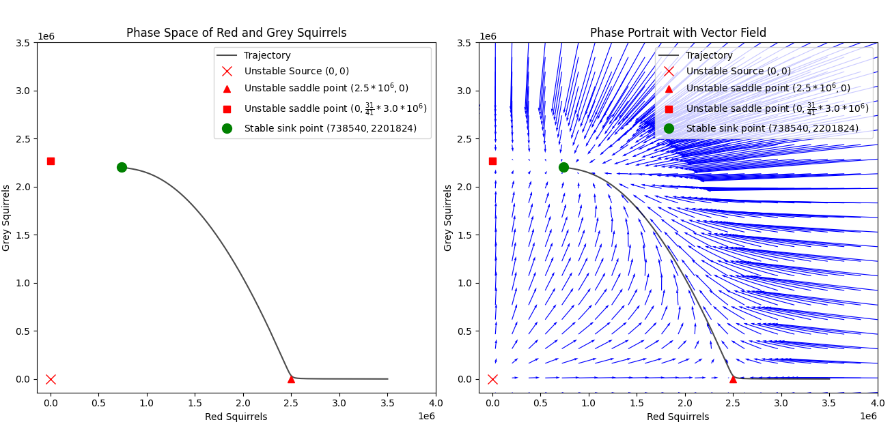

[comment]: # (This is how you can make comments without affecting the output file or preview, the above section is the YAML btw, it is not rendered either but rather sets custom global markdown formatting for pdf/html output)
[comment]: # (Use `pandoc test.txt -o test.pdf` in the zsh terminal for compilation)

# MA2MMS modelling written project Group 1 - Modelling Biological/Ecological Systems

*Nick Scerbacenco, Keisha Markey Patel and Henry Davis*

*University of Reading*  

## Abstract

This study models the population dynamics of red and grey squirrels in the UK, focusing on their competitive interactions. Using the Lotka-Volterra competition model and the 4th-order Runge-Kutta method, we analyze population stability and long-term behavior. 

The findings indicate that grey squirrels negatively impact red squirrel populations through competition and disease, with grey squirrels dominating in most areas. However, implementing a harvesting strategy for grey squirrels could significantly aid red squirrel recovery. 

These insights underscore the need for targeted control measures and habitat management to support the conservation of native red squirrels.

## Table of contents

1. [Description of the ecological system](#description-of-the-ecological-system)
2. [Introduction](#introduction)
3. [Model selection](#model-selection)
	1. [Choosing coefficients](#choosing-coefficients)
4. [Stability of the model](#stability-of-the-model)
	1. [Phase space](#phase-space)
5. [Numerical solution](#numerical-solution)
	1. [Bifurcation](#Bifurcation)
6. [Predictions](#predictions)
7. [Possible improvements and sustainability](#possible-improvements-and-sustainability)
	1. [Testing improved models](#testing-improved-models)
	2. [Stability of the improved model](#stability-of-the-improved-model)
8. [Conclusion](#conclusion)
9. [Appendix](#appendix)
	1. [Notes on stability](#notes-on-stability)
	2. [Notes on Runge-Kutta](#notes-on-runge-kutta)
	3. [Python code](#python-code)
		1. [4th-order Runge-Kutta method](#4th-order-runge-kutta-method)
		2. [Visualising harvesting effects](#visualising-harvesting-effects)
	1. [Bibliography](#bibliography) 

# Description of the ecological system

This report outlines the relationship between the red squirrel and the grey squirrel in the UK. The two species have a very tense relationship due to competition and displacement which has affected their individual populations. We will look at the different numbers of each and format solvable equations for the each of the populations of the two species. As time has gone on, the population of grey squirrels has increased while the population of red squirrels has decreased. First, we need to look at the kind of relationship that the pair have and the varied biotic and abiotic factors that affect their population sizes. While red and grey squirrels do not directly compete against each other, they compete in terms of food resources and habitats. 

# Introduction

Grey squirrels were introduced to the UK in 19th century and over time have outcompeted red squirrels in their habitats. This is due to their larger builds, their adaptability, and immunity from certain diseases, meaning that the grey squirrel can outcompete the red squirrel without direct harm. The grey squirrel primarily outcompetes the red squirrel through the monopolisation of food *resources*$^{[2]}$ (Wildlife Online, n.d.), leaving the red squirrel with a limited supply. It is undoubtable that the grey squirrel has populated much of the urban environment while the red squirrel tends to reside in more rural areas. This is a good representation of the grey squirrels’ adaptability, their ability to fit into the environment that they find and even go to the extent of consuming the different foods available *there*$^{[2]}$ (Wildlife Online, n.d.), including that of a more urban area. 

Grey squirrels currently populate the UK in many places, carrying diseases such as squirrel pox, which although is not very harmful to them, it is fatal if passed on to a red *squirrel*$^{[1]}$ (Red Squirrel Survival Trust, n.d.). This, in turn, decreases the number of red squirrels while the population of the grey squirrels is only marginally decreased. Alongside this, they are significantly larger than the red squirrel, making them the more likely survivor when in combat with competitors or predators, such as the pine marten. Due to the red squirrel's sensitive immune system, they have on average a lower life expectancy than that of the red squirrel. The red squirrel typically lives up to three years$^{[1]}$ (Red Squirrel Survival Trust, n.d.), while the grey squirrel usually lives up to nine years in the *wild*$^{[4]}$ (Wytham Woods, n.d.). Both species have been known to live up to ten or even fifteen years old, however, the contributions of the outside world, especially the different diseases they face, lowers this significantly. 

Currently, the grey squirrel is the dominant species, while the red squirrel population is declining. However, the population of the red squirrel is slowly rising as the population of the pine marten increases. The pine marten is the natural predator to the grey squirrel, which has a “strong negative” $^{[3]}$ (British Red Squirrel, n.d.) impact on their numbers, allowing the red squirrel to benefit and thrive as there is less competition for the red squirrel. After being pushed to near extinction, the red squirrel finds peaceful habitat in places less abundant with grey squirrels, meaning their numbers can slowly increase. Evidence was found to suggest that rather than the grey squirrel being hunted by the pine marten to decrease their numbers, the grey squirrel started to migrate to areas less populated with the pine marten. The red squirrel, in turn, benefitted from this, as they were given more land and area to populate without being disturbed by the grey squirrel and their numbers stared to increase. Furthermore, the culling of grey squirrels in legal in the UK as a way of controlling their population size and allowing the population of the red squirrel to increase $^{[5]}$ (British Red Squirrel, n.d.). This includes trapping, shooting, fertility control and more. 

Looking into the history of the introduction of both of the species, we can start to compare the numbers and substitute them into the Lotka-Volterra Competition model. The introduction of the grey squirrel in England was in 1876 and continued to be released until the 1920’s when the destruction of the red squirrel population was noticed and it soon became illegal to release a grey squirrel into the wild$^{[6]}$ (British Red Squirrel, n.d.). Red squirrels, however, are native to the UK and lived in the UK prior to the grey squirrel for around 10,000 years$^{[7]}$ (The Wildlife Trusts, 2020). It is estimated that at the time of the introduction of grey squirrels, the red squirrel population stood at roughly 3,500,000 and has decreased to 140,000 in the past years, while the grey squirrel population has increased to approximately 2,520,000 recorded in 2009$^{[8]}$ (Aebischer, Davey and Kingdon, 2011). We have taken the carrying capacity of grey squirrels to be 3,000,000 and used this to find that the carrying capacity for red squirrels is 2,500,000$^{[7]}$ (The Wildlife Trusts, 2020).

# Model selection 

Our aim is modelling *global* populations of red and grey squirrels over time. We begin by considering the *generic* *Lotka-Volterra* system s.t. 

$$
\overset{\text{Generic Model}}{
\boxed{
\begin{aligned}
\frac{\mathrm{d}x}{\mathrm{d}t} &= x(r_1 + a_{11}x + a_{12}y), \\
\frac{\mathrm{d}y}{\mathrm{d}t} &= y(r_2 + a_{21}x + a_{22}y).
\end{aligned}
}
}
$$

where $x$ and $y$ would represent the populations of red and grey squirrels respectively,

- $r_{1}$ - idealistic growth rate of red squirrels 
- $r_{2}$ - idealistic growth rate of grey squirrels 
- $a_{11}$ - measure of limitation on red squirrels
- $a_{22}$ - measure of limitation on grey squirrels 
- $a_{12}$ - measure of competition towards red squirrels i.e. the effect of grey squirrels on red squirrels
- $a_{21}$ - measure of competition towards greys squirrels i.e. effect of red squirrels on grey squirrels

${N}\mkern -8.2mu\textcolor{red}{{B}}$ $a_{11}$ and $a_{22}$ along with $r_{1}$ and $r_{2}$ respectively yield the carrying capacities $K_{R}$ and $K_{G}$.

The model in this form is very clear and versatile as it allows easy implementation into numerical algorithms because the equations do not involve division.
 
${N}\mkern -8.2mu\textcolor{red}{{B}}$ This form will prove to be convenient when we will solve the system numerically later on.

For now we introduce a new form of our model with the carrying capacities $K_{R}$ and $K_{G}$ explicitly present to aid analysis of stability.      

### Choosing coefficients
 
Using the *generic* *Lotka-Volterra* Competitive model in a *refined form*$^{[12]}$(Brouwer et al., 2022)

$$
\overset{\text{Generic Model - Refined form}}{
\boxed{
\begin{aligned}
\frac{\mathrm{d}x}{\mathrm{d}t} &= r_{R}x\left(1-\frac{x+\alpha_{RG}y}{K_{R}}\right) \\
\frac{\mathrm{d}y}{\mathrm{d}t} &= r_{G}y\left(1-\frac{y+\alpha_{GR}x}{K_{G}}\right) 
\end{aligned}
}}
$$

where $x(t)$ and $y(t)$ represent the population of red and grey squirrels at a given time $t$,
$r_{R}$ and $r_{G}$ represent the intrinsic growth rates of red and grey squirrels respectively,
$K_{R}$ and $K_{G}$ represent the carrying capcity of red and grey squirrels,
and finally $\alpha_{RG}$ and $\alpha_{GR}$ represent the competition coefients.

${N}\mkern -8.2mu\textcolor{red}{{B}}$ This model is based on the logistic growth model ($\frac{\mathrm{d}x}{\mathrm{d}t} = rx ( 1 - \frac{x}{K} )$ ), with the addition of competition between the two species as they compete for the same natural resources. 

We have selected $r_{R}=0.61$, $r_{G}=0.82$ directly from $^{[13]}$(Okubo et al., n.d., pp.115–117). We have also estimated $\alpha_{RG}$ and $\alpha_{GR}$ with refrence to $^{[13]}$(Okubo et al., n.d., pp.115–117) 'We expect that the competition $c_{1}$, i.e. red against grey should have a small value' thus we chose $\alpha_{GR}=0.09$. We selected $\alpha_{RG}=0.8$ because in sympatric populations grey squirrels have significantly 'greater energetic demands' $^{[14]}$(Bryce et al., 2001), thus $\alpha_{RG}$ >> $\alpha_{GR}$ as both species compete for similar resources and the grey squirrels' ability to consume resources at higher rates causes a much higher negative effect on the red squirrel population growth rate. We also chose $K_{G}=3\cdot10^6$, $K_{R}=2.5\cdot10^6$ using the carrying capacities discussed in the introduction. 

# Stability of the model

We have the coupled differential equations

$$ 
\frac{\mathrm{d}x}{\mathrm{d}t} = 0.61x\left(1-\frac{x+0.8y}{K_{R}}\right) 
$$
$$ 
\frac{\mathrm{d}y}{\mathrm{d}t} = 0.82y\left(1-\frac{y+0.09x}{K_{G}}\right) 
$$

where $K_{G} = 3 \cdot 10^{6}$ and $K_{R} = 2.5 \cdot 10^{6}$

To find the stability of the model, we have to find the equilibria of the system of equations and examine the stability of these points. We do this by finding the x and y nullclines of the system - curves in the phase plane where $\frac{\mathrm{d}x}{\mathrm{d}t} = 0$ and $\frac{\mathrm{d}y}{\mathrm{d}t} = 0$ respectively. The intersection of these curves gives the equilibrium points since both rates of changes are simultaneously equal to zero, meaning both populations aren't varying at that specific moment in time.

The x-nullclines are found to be $x = 0$ or $x = K_{R} - 0.8y$; and the y-nullclines are found to be $y = 0$ or $y = K_{G} - 0.09x$.

The intersections of the x and y nullclines, and are given to be: 
- $(0,0)$, the origin point where both populations are extinct;
- $(K_{R},0)$, the red squirrel population is at their carrying capacity while the grey squirrel population is extinct
- $(K_{G},0)$, the grey squirrel population is at their carrying capacity while the red squirrel population is extinct
- $(\frac{K_{R}-0.8K_{G}}{0.928},\frac{K_{G}-0.09K_{R}}{0.928})$, both populations can co-exist.

Now we calculate the Jacobian matrix of the system to linearize the system of equations around each equilibrium point so we can find the behaviour and tradjectories of nearby points, hence finding the stability of the equibria.

${N}\mkern -8.2mu\textcolor{red}{{B}}$ The Jacobian matrix formula can be found in the appendix [Notes on stability](#notes-on-stability)

The Jacobian matrix is given by:

$$ 
J(x,y) = \begin{bmatrix} 0.61 - \frac{1.22}{K_{R}}x - \frac{0.488}{K_{R}}y & -\frac{0.488}{K_{R}} \\
-\frac{0.0738}{K_{G}}y & 0.82 - \frac{0.18}{K_{G}}y - \frac{0.0738}{K_{G}}x \end{bmatrix} 
$$

At the equilibrium point $(0,0)$, we have the Jacobian matrix

$$ 
J(0,0) = \begin{bmatrix} 0.61 & 0 \\
0 & 0.82 \end{bmatrix} 
$$

Since $J(0,0)$ is a diagonal matrix, the eigenvalues are directly the diagonal elements $\lambda_{1} = 0.61$ and $\lambda_{2} = 0.82$. Since these eigenvalues are non-positive real numbers, the corresponding fixed point is an unstable source. This means that all nearby trajectories move away from the point - small introductions of either populations will cause the system to move away from extinction towards positive populations of squirrels.

At the equilibrium point $(K_{R},0)$, we have the Jacobian matrix

$$ 
J(K_{R},0) = \begin{bmatrix} -0.61 & -0.488 \\
0 & 0.82 - \frac{0.0738K_{R}}{K_{G}}\end{bmatrix} 
$$

Since $J(K_{R},0)$ is an upper triangular matrix, the eigenvalues are directly the diagonal elements $\lambda_{1} = -0.61$ and $\lambda_{2} = 0.82 - \frac{0.0738K_{R}}{K_{G}} = 0.7585$. Since these eignevalues are real numbers with $\lambda_{1} < 0 < \lambda_{2}$, the corresponding fixed point is an unstable saddlepoint.

Also, at the equilibrium point $(0,K_{G})$, we have the Jacobian matrix

$$ 
J(0,K_{G}) = \begin{bmatrix} 0.61 - \frac{0.488K_{G}}{K_{R}} & 0 \\
-0.0738 & -0.82 \end{bmatrix} 
$$

Since $J(0,K_{G})$ is a lower triangular matrix, the eigenvalues are directly the diagonal elements $\lambda_{1} = 0.61 - \frac{0.488K_{G}}{K_{R}} = 0.0244$ and $\lambda_{2} = -0.82$. Since these eignevalues are real numbers with $\lambda_{2} < 0 < \lambda_{1}$, the corresponding fixed point is an unstable saddlepoint.

Therefore at each saddlepoint $(K_{R},0)$ and $(0,K_{G})$ populations lying on the stable manifold (an eigendirection tangent to the eigenvector formed from the negative eigenvalue in the linearized system) will approach red/grey squirrel dominace respectively. While all other points move away aproaching either coexistance or grey/red squirrel dominance respectively.

Finally at the equilibrium point $\left(\frac{K_{R}-0.8K_{G}}{0.928}, \frac{K_{G}-0.09K_{R}}{0.928}\right) \approx (107758, 2990301)$ _taking the floor of these values since the populations of x and y are whole numbers_, we have the Jacobian matrix

$$ 
J\left(\frac{K_{R}-0.8K_{G}}{0.928},\frac{K_{G}-0.09K_{R}}{0.928}\right) = \begin{bmatrix} \frac{0.488K_{G} - 0.61K_{R}}{0.928K_{R}} & \frac{0.3904K_{G} - 0.488K_{R}}{0.928K_{R}} \\
\frac{0.006642K_{R} - 0.0738K_{G}}{0.928K_{G}} & \frac{0.738K_{R} - 0.82K_{G}}{0.928K_{G}} \end{bmatrix} 
$$

$J(\frac{K_{R}-0.8K_{G}}{0.928},\frac{K_{G}-0.09K_{R}}{0.928})$ has two eigenvalues which are 

$$
\lambda_{1,2} = \frac{1}{2} \left[
\frac{0.488 K_{G}^2 + 0.738 K_{R}^2 - 1.43 K_{R} K_{G}}{0.928 K_{R} K_{G}} \pm \sqrt{ \left( \frac{\phi}{0.928 K_{R} K_{G}} \right)^2 -4\frac{\mu}{(0.928)^2 K_{R} K_{G}}}\right]
$$

Where: 
- $\phi = 0.488K_{G}^2 + 0.738K_{R}^2 - 1.43K_{R}K_{G}$; 
- $\mu = (0.488K_{G} - 0.61K_{R})(0.738 K_{R} - 0.82K_{G}) -(0.3904K_{G} - 0.488K_{R})(0.006642K_{R} - 0.0738K_{G})$.

Since these eigenvalues are real, negative numbers, ($\lambda_{1} \approx -0.0186$ and $\lambda_{2} \approx -0.2287$) the corresponding fixed point is an asymptotically stable sink point. This means all tradjectories starting from positive initial populations - that do not lie on the saddlepoints' stable manifolds, will converge to this equilibria point over time causing both squirrel populations to coexist with eachother.

## Phase space 

The phase space plot displays the trajectory ending at our sink point as expected. 
We also plotted a phase portrait with vectors visualising the flow towards the sink point as we start with different ICs close to it. 

>



>

${N}\mkern -8.2mu\textcolor{red}{{B}}$ Changing the ICs would implicitly change all following approximations, however as we have shown analytically, the system would eventually settle to a steady state for *all* realistic ICs .


# Numerical solution

For the purposes of constructing our numerical algorithm, we return to our generic model in its original form. So we must calculate the coefficients $r_{1},r_{2},a_{11},a_{12},a_{21},a_{22}$ for our populations $x$ and $y$ of red and grey squirrels respectively. 

$$
\begin{aligned}
\frac{\mathrm{d}x}{\mathrm{d}t} &= r_{R}x\left(1-\frac{x+\alpha_{RG}y}{K_{R}}\right) \\
\frac{\mathrm{d}y}{\mathrm{d}t} &= r_{G}y\left(1-\frac{y+\alpha_{GR}x}{K_{G}}\right) 
\end{aligned} \qquad \longrightarrow \qquad
\begin{aligned}
\frac{\mathrm{d}x}{\mathrm{d}t} &= x(r_1 + a_{11}x + a_{12}y), \\
\frac{\mathrm{d}y}{\mathrm{d}t} &= y(r_2 + a_{21}x + a_{22}y).
\end{aligned}
$$

We expand the equations and compare coefficients for $x = R$ and $y=R$ s.t. 

$$
\begin{aligned}
\frac{\mathrm{d}x}{\mathrm{d}t} &= r_R x \left(1 - \frac{x}{K_R} - \frac{y \alpha_{RG}}{K_R}\right) = \underbrace{r_R}_{r_1} x + \underbrace{\left(-\frac{r_R}{K_R}\right)}_{a_{11}} x^2 + \underbrace{\left(-\frac{r_R \alpha_{RG}}{K_R}\right)}_{a_{12}} xy \\
\frac{\mathrm{d}y}{\mathrm{d}t} &= r_G y \left(1 - \frac{G}{K_G} - \frac{x \alpha_{GR}}{K_G}\right) = \underbrace{r_G}_{r_2} y + \underbrace{\left(-\frac{r_G \alpha_{GR}}{K_G}\right)}_{a_{21}} xy + \underbrace{\left(-\frac{r_G}{K_G}\right)}_{a_{22}} y^2
\end{aligned}
$$

${N}\mkern -8.2mu\textcolor{red}{{B}}$ We use coefficients found above, $K_{G}=3\cdot10^6$, $K_{R}=2.5\cdot10^6$, $\alpha_{RG}=0.8$ and $\alpha_{GR}=0.09$. 

$$
\text{By comparison we have}  \qquad \boxed{
\begin{aligned}
r_1 &= r_R \\
r_2 &= r_G \\
a_{11} &= -\frac{r_R}{K_R} \\
a_{12} &= -\frac{r_R \alpha_{RG}}{K_R} \\
a_{21} &= -\frac{r_G \alpha_{GR}}{K_G} \\
a_{22} &= -\frac{r_G}{K_G}
\end{aligned}
} \quad \longrightarrow \quad \boxed{
\begin{aligned}
r_{1} &= 0.61 \\
r_{2} &= 0.82 \\
a_{11} &= -2.44\cdot10^{-7} \\
a_{12} &= -1.952\cdot10^{-7} \\
a_{21} &= -2.46 \cdot 10^{-8} \\
a_{22} &= -2.7\dot{3} \cdot 10^{-7} 
\end{aligned}
}
$$

$\textcolor{red}{!}$ The $a_{22}$ is a recurring decimal marked $\dot{3}$. In the actual implementation, 8 decimal points will be used to minimise the *roundoff error*.  

We proceeded to plot the populations of red and grey squirrels in discrete time using the *4th order Runge-Kutta method* (RK4) which is a robust general-purpose numerical method with a $\mathcal{O}(h^5)$ *Local Truncation Error*.
${N}\mkern -8.2mu\textcolor{red}{{B}}$ We chose RK4 as it is the most optimal explicit method for its number of $k$ *stages*.

We avoided the use of "*black boxes*" and fully implemented the RK4 method in python, please refer to the *[appendix](#python-code)* for the whole code, the general logic behind it is passing the `squirrely`  function into the `rk4` function which uses `k` correctors that are then weighed to produce the next timestep $U^{n+1}$ which is sorted in the $n+1$th column of the array `u`.  
${N}\mkern -8.2mu\textcolor{red}{{B}}$ The first row and second rows of `u` correspond to the populations of red squirrels and grey squirrels respectively.   
We have the initial conditions (ICs) stored in `u0` which we set to be the first column of `u`, every other $n$th approximation $U^n$ is explicitly calculated using the $n-1$th approximation.

```python
u[:, 0] = u0
for i in range(1, len(t_values)):
    u_out = rk4(squirrely, h, t_values[i - 1], u[:, i - 1])
    u[:, i] = u_out
print(u)
```

### Bifurcation

We considered the potential for *bifurcation*$^{[10]}$ both in our system and the numerical method. The system used is nonlinear which yields *bifurcation* as the solution goes from unstable to stable equilibrium points, this would not be a problem here because realistic ICs are far from the unstable equilibrium points found above.
It is well known that the *4th Runge-Kutta* method may yield *spurious bifurcation* that is due to the numerical method and **not** the underlying system itself. To make sure this is not a problem, we tested the script with slightly different timesteps `h` and ICs and examined the resulting plots.  

# Predictions

We set the ICs to be 3500000 red squirrels and 10000 grey squirrels which should roughly reflect the squirrel population in 1930 which is the year when importing and releasing grey squirrels became illegal$^{[11]}$. 

- The 3.5 million red squirrel population IC is reasonable as that was the rough estimate of the red squirrels prior to competition with grey squirrels as described in the introduction. 
- The 10 thousand grey squirrel population in 1930 is a rough estimate of how the population increased from marginal imports throughout the UK from 1870s to 1930.

The stable squirrel populations found analytically are $(\frac{K_{R}-0.8K_{G}}{0.928},\frac{K_{G}-0.09K_{R}}{0.928}) \approx (107758, 2990301)$ which can be seen in the plot below. 

>



>

We can see that the grey squirrel population steeply increased in size between 1940 and 1960 which reflects how grey squirrels completely outcompeted red squirrels in most regions in England and established a permanent population. 

# Possible improvements and sustainability 

The model presented above is quite good and predicts that the populations of red and grey squirrels today would stand at roughly 110 thousand and 3 million which is surprisingly close to the empirical estimations of 140 thousand and 2.5 million. The model slightly overestimated the population of grey squirrels and underestimated that of red squirrels.

To enable us to have a more exact system for the populations of both species, we would need to take into consideration the decline in populations as much as the increase in them. For example, the culling of grey squirrels and the death rate of red squirrels from diseases. As mentioned before, it is legal to cull grey squirrels in the UK by means of trapping, shooting and more. It is estimated that “tens of thousands” of grey squirrels are killed each year through culling$^{[9]}$ (Viva!, 2023). The decline of the squirrel population is due to many varied reasons, trauma, road accidents, disease, and predation. However, the decline in numbers of the red squirrel is smaller than the grey squirrel. We can use these facts in an adapted model that also incorporates a harvesting coefficient. Here, the coefficient of the red squirrel harvesting is smaller than that of the grey squirrel. This creates a more accurate model for the populations of both of the animals.

Looking into the future of the populations of grey and red squirrels, the control of the grey squirrel numbers alongside the conservation of red squirrels could mean that the red squirrel can thrive once more. Many routes are currently being taken to allow this to happen, making the populations of both more sustainable for the environment. If the combination of culling, habitat control and fertilisation can proceed with the protection and conservation of red squirrels, an equilibrium of both population sizes can be reached. It is very unlikely that both types of animals will ever be able to coesxist in the same habitat as each other, however, this could enstore a more stable population size for both. 

To make the model more *realistic* we improve it by adding a harvesting term $Hy$ of the grey squirrels

$$
\overset{\text{Improved Model}}{
\boxed{
\begin{aligned}
\frac{\mathrm{d}x}{\mathrm{d}t} &= x(r_1 + a_{11}x + a_{12}y), \\
\frac{\mathrm{d}y}{\mathrm{d}t} &= y(r_2 + a_{21}x + a_{22}y+H).
\end{aligned}
}
}
$$

where $H$ is a negative constant and represents the overall effect of culling and uneven survival odds compared to red squirrels in regions populated with pine martens. 

${N}\mkern -8.2mu\textcolor{red}{{B}}$ Red squirrels are much better at avoiding pine martens relative to grey squirrels.

## Testing improved models

We proceed by choosing a value of $H$ that would result in populations of 140 thousand red squirrels and 2.5 million greys squirrels in 2020s.
We do so through a *heuristic approach* where we plot the trajectories for the populations over time for different values of $H$. We try out values $-0.2, -0.1, -0.05, -0.03, -0.01$ for $H$ and examine the resulting trajectories. We also plot the empirically estimated populations as a target line. 

>



>

${N}\mkern -8.2mu\textcolor{red}{{B}}$ The code for the script that plots multiple trajectories for different values for harvesting shown above can be found in the *[appendix](#visualising-harvesting-effects)*.

$\textcolor{red}{!}$ From the plots we can see that the *target line* lies between the $H$ values of $-0.1$ and $-0.2$ for the grey population and at around $H=-0.01$ for the Red population. This hints at us that the model with harvesting is not entirely appropriate to *exactly* coincide with the empirical estimates because there is no real value $H$ we can pick that is both $-0.1<H<-0.2$ and $H<0.01$. 
This is however expected as there is great variance in the empirical reports for squirrel population. 
The improved models with harvesting are all within close proximity to empirical findings. 

As we can see the higher the magnitude of $H$ the bigger the red squirrel population which is as  expected. 

We thereby choose the value of $H$ to be $-0.2$ because that would result in a steady red squirrel population of around 740 thousand which is a significant improvement from a population of 110 thousand in our last model. 

***This demonstrates that if a harvesting of $H=-0.2$ can be practically achieved then we would expect the population of red squirrels to increase by 600 thousand over time.***

## Stability of the improved model

With the addition of havesting we have:

$$
\begin{aligned}
\frac{\mathrm{d}x}{\mathrm{d}t} &= r_{R}x\left(1-\frac{x+\alpha_{RG}y}{K_{R}}\right) \\
\frac{\mathrm{d}y}{\mathrm{d}t} &= r_{G}y\left(1-\frac{y+\alpha_{GR}x}{K_{G}}\right) + Hy 
\end{aligned} \quad \longrightarrow \quad
\begin{aligned}
\frac{\mathrm{d}x}{\mathrm{d}t} &= r_{R}x\left(1-\frac{x+\alpha_{RG}y}{K_{R}}\right) \\
\frac{\mathrm{d}y}{\mathrm{d}t} &= r_{G}y\left(1 + \frac{H}{r_{G}} - \frac{y+\alpha_{GR}x}{K_{G}}\right)
\end{aligned} \quad \longrightarrow \quad
\begin{aligned}
\frac{\mathrm{d}x}{\mathrm{d}t} &= 0.61x\left(1-\frac{x+0.8y}{K_{R}}\right) \\
\frac{\mathrm{d}y}{\mathrm{d}t} &= 0.82y\left(\frac{31}{41} - \frac{y+0.09x}{K_{G}}\right)
\end{aligned}
$$

Calculating the nullclines as before, we have the equilibrium points $(0,0)$, $(K_{R}, 0)$, $(0, \frac{31}{41}K_{G}) \approx (0, 2268292)$ and $(\frac{K_{R}-\frac{124}{205}K_{G}}{0.928}, \frac{\frac{31}{41}K_{G}-0.09K_{R}}{0.928}) \approx (738540, 2201824)$. We then calculate the Jacobians and their corresponding eigenvalues to analyse the stability - the results are highlighted below.


| Equilibrium Points                          | Eigenvalues                        | Stability                     |
|---------------------------------------------|------------------------------------|-------------------------------|
| $(0,0)$                                       | $\lambda_{1} = 0.61$, $\lambda_{2} = 0.62$              | Unstable source               |
| $(2500000, 0)$                                    | $\lambda_{1} = -0.61$, $\lambda_{2} = 0.5585$           | Unstable saddle point         |
| $(0, \frac{31}{41}K_{G})$                              | $\lambda_{1} = 0.0244$, $\lambda_{2} = -1.03$           | Unstable saddle point         |
| $(\frac{K_{R}-\frac{124}{205}K_{G}}{0.928}, \frac{\frac{31}{41}K_{G}-0.09K_{R}}{0.928})$  | $\lambda_{1} \approx -0.162$, $\lambda_{2} \approx -0.620$          | Asymptotically stable sink point |

From the table we can clearly see as predicted, taking $H = -0.2$, gives us a co-existance point at $(738540, 2201824)$.

> 



>

\pagebreak

${N}\mkern -8.2mu\textcolor{red}{{B}}$ The code used for figure 1 was also used to generate figure 4 by adding a `-0.2` harvesting to the `squirrely` function and the `V` vector field equation.   

# Conclusion

Throughout this study, we have looked at the population dynamics of the red and grey squirrels in the UK. We have clearly illustrated the competitive dominance of the grey squirrel against the red squirrel and further looked at the impact that the numbers of grey squirrels have on the red squirrel population. The two share a very tense relationship and it is noticeable that the population of grey squirrels has a direct impact on the population of red squirrels. It is undoubtable that as the numbers of grey squirrels increases, the number of red squirrels decrease, but a variations of different schemes have been put in place to aid the growth of the red squirrel population in the UK. After incorporating a harvesting modelling scheme into the Lotka-Volterra model which reflects the many approaches that are being taken to increase the population of the red squirrel and the results showed us some more information on this increase. We can see that by reducing the number of grey squirrels in the UK, the red squirrel population has the potential to grow by over 600,000 individuals. 

Our findings have emphasised the importance of these targeted control measures, including culling and habitat management to support the red squirrel conservation. These insights have provided actionable strategies for sustainable species management and highlight the value of mathematical modelling in the addressing of ecological changes in the environment. This goes to show that as much as putting these different plans into place, it is imperative that the numbers are studied to see if they are having a positive, negative effect or any impact at all. We can clearly see that the conservation methods that are being used for red and grey squirrels in having a positive impact on the red squirrel population and humanly managing the numbers of grey squirrels in the UK. 

\pagebreak

# Appendix

## Notes on stability 

Jacobian formula

$$
J(R,G) =\begin{bmatrix}
\frac{\partial{F}}{\partial{R}} & \frac{\partial{F}}{\partial{G}} \\
\frac{\partial{E}}{\partial{R}} & \frac{\partial{E}}{\partial{G}}
\end{bmatrix}
$$

Where $F(R,G) = \frac{\mathrm{d}R}{\mathrm{d}t}$ and $E(R,G) = \frac{\mathrm{d}G}{\mathrm{d}t}$

## Notes on Runge-Kutta

An $s$-stage **Runge–Kutta method** approximates $u$ by specifying constants $a_{ij}$, $b_j$ 
and $c_i$ for $i,j = 1,2,\dots,s$ where $s \in \mathbb{N}$.

$$
\overset{\text{Compute the $s$ intermediary steps}}{\boxed{k_i = f\bigl(t_{n-1} + c_i\,h,\;U^{n-1} + h\sum_{j=1}^s a_{ij}\,k_j\bigr) \quad \text{for} \quad i = 1,2,\dots,s}} \qquad \overset{\text{Compute the $n$th approximation}}{\boxed{U^n = U^{n-1} + h\sum_{j=1}^s b_j\,k_j}}
$$

## Python code 

### 4th-order Runge-Kutta method 

```python 
import numpy as np
import matplotlib.pyplot as plt

# Parameters
r1 = 0.61   # idealistic growth rate of red squirrel 
r2 = 0.82   # idealistic growth rate of grey squirrel (higher cuz greys breed faster)
'''(a11 higher cuz native habitat and ability to avoid predators like pine martens)'''
a11 = -2.44 * 10 ** -7    # limitation for red squirrel  i.e. yields carrying capacity along with r1  
a12 = -1.952 * 10 ** -7   # competition towards red squirrel  i.e. how much grey squirrel hurts red squirrel (higher cuz SQPV and size)
a21 = -2.46 * 10 ** -8    # competition towards grey squirrel i.e. how much red squirrel hurts grey squirrel 
a22 = -2.73333333 * 10 ** -7   # limitation for grey squirrel i.e. yields carrying capacity along with r2 
u0 = [3500000, 1000] # ICs
# Equilibria at [107758, 2990301]


# Functions setup
'''xdot = x(r1 + a11*x + a12*y)'''
'''ydot = y(r2 + a21*x + a22*y)'''

def rk4(fun, dt, t0, u0):
    """Runge-Kutta 4th order method
    fun: function that returns the derivative of u at time t
    """
    k1 = fun(t0, u0)
    k2 = fun(t0 + dt / 2, u0 + dt / 2 * k1)
    k3 = fun(t0 + dt / 2, u0 + dt / 2 * k2)
    k4 = fun(t0 + dt, u0 + dt * k3)
    u_out = u0 + (dt / 6) * (k1 + 2 * k2 + 2 * k3 + k4)
    return u_out

def squirrely(t0, u):
    """Function that returns the derivative of u at time t
    u is array s.t. [x, y] where x is reds population and y is greys population
    """
    udot = [u[0] * (r1 + a11 * u[0] + a12 * u[1]), 
         u[1] * (r2 + a21 * u[0] + a22 * u[1])]
    return np.array(udot)

# Computing values 
h = 0.001
T_max = 115 # 115 years
t_values = np.arange(0+1930, T_max + 1930 + h, h)
u = np.zeros([2, len(t_values)])
print(u)

u[:, 0] = u0
for i in range(1, len(t_values)):
    u_out = rk4(squirrely, h, t_values[i - 1], u[:, i - 1])
    u[:, i] = u_out
print(u)

# Plotting the population dynamics (ax[0]) in a separate figure
fig1, ax1 = plt.subplots(figsize=(8, 6))
ax1.plot(t_values, u[0, :], label='Red Squirrels', color='red')
ax1.plot(t_values, u[1, :], label='Grey Squirrels', color='grey')
ax1.set_xlabel('Time in years starting from 1930')
ax1.set_ylabel('Population Size')
ax1.set_title('Population Dynamics of Red and Grey Squirrels')
ax1.axhline(107758, color='red', linestyle='--', label='Red Equilibrium')
ax1.axhline(2990301, color='grey', linestyle='--', label='Grey Equilibrium')
ax1.legend()
fig1.tight_layout()
plt.show()

# Define a grid around the stable saddle point
x_vals = np.linspace(107758 - 50000, 107758 + 50000, 20)  # Red squirrel range
y_vals = np.linspace(2990301 - 500000, 2990301 + 500000, 20)  # Grey squirrel range
X, Y = np.meshgrid(x_vals, y_vals)

# Add a new subplot for the phase portrait with vectors using quiver
# Define a grid covering the entire trajectory range
x_min, x_max = 0, 4e6  # Adjust based on trajectory data
y_min, y_max = -0.1e6, 3.5e6
x_vals = np.linspace(x_min, x_max, 25)
y_vals = np.linspace(y_min, y_max, 25)
X, Y = np.meshgrid(x_vals, y_vals)

# Compute the vector field
U = X * (r1 + a11 * X + a12 * Y)
V = Y * (r2 + a21 * X + a22 * Y)

# Plotting phase space(s)
fig2, (ax2, ax3) = plt.subplots(1, 2, figsize=(16, 8))

# Phase space
ax2.plot(u[0, :], u[1, :], label='Trajectory', color='black', alpha=0.7)
ax2.set_xlabel('Red Squirrels')
ax2.set_ylabel('Grey Squirrels')
ax2.set_title('Phase Space of Red and Grey Squirrels')
ax2.plot(107758, 2990301, 'go', markersize=10, label='Stable sink point $(107758, 2990301)$')
ax2.legend()
ax2.set_xlim(x_min, x_max)  # Synchronize x-axis
ax2.set_ylim(y_min, y_max)  # Synchronize y-axis
ax2.set_aspect('equal', adjustable='box')  # Equal aspect ratio

# Phase space with vector field
ax3.plot(u[0, :], u[1, :], label='Trajectory', color='black', alpha=0.7)
ax3.quiver(X, Y, U, V, color='blue', angles='xy', 
           scale_units='xy', scale=1.7, width=0.002, headwidth=3)
ax3.set_xlabel('Red Squirrels')
ax3.set_ylabel('Grey Squirrels')
ax3.set_title('Phase Portrait with Vector Field')
ax3.plot(107758, 2990301, 'go', markersize=10, label='Stable sink point')
ax3.set_xlim(x_min, x_max)  # Synchronize x-axis
ax3.set_ylim(y_min, y_max)  # Synchronize y-axis
ax3.set_aspect('equal', adjustable='box')  # Equal aspect ratio
ax3.legend()

fig2.tight_layout()
plt.show()
```

### Visualising harvesting effects

```python
import numpy as np
import matplotlib.pyplot as plt

# Parameters
r1 = 0.61
r2 = 0.82
a11 = -2.44e-7
a12 = -1.952e-7
a21 = -2.46e-8
a22 = -2.73333333e-7

u0 = np.array([3.5e6, 1e4])
t0, T = 1930, 2025
dt = 0.1
t_values = np.arange(t0, T + dt, dt)

# RK4
def rk4(fun, dt, t, u):
    k1 = fun(t, u)
    k2 = fun(t + dt/2, u + dt/2 * k1)
    k3 = fun(t + dt/2, u + dt/2 * k2)
    k4 = fun(t + dt,   u + dt * k3)
    return u + (dt/6) * (k1 + 2*k2 + 2*k3 + k4)

def squirrely(t, u, H):
    R, G = u
    dR = R * (r1 + a11 * R + a12 * G)
    dG = G * (r2 + a21 * R + a22 * G + H)
    return np.array([dR, dG])

# Heuristic H values to test
H_values = [-0.2, -0.1, -0.05, -0.03, -0.01]

fig, (axR, axG) = plt.subplots(2, 1, figsize=(10, 8), sharex=True)

R_target, G_target = 140000, 2500000
axR.axhline(R_target, linestyle='--', label='Red target')
axG.axhline(G_target, linestyle='--', label='Grey target')

for H in H_values:
    u = np.zeros((2, len(t_values)))
    u[:, 0] = u0
    for i in range(1, len(t_values)):
        u[:, i] = rk4(lambda t, y: squirrely(t, y, H), dt, t_values[i-1], u[:, i-1])
    axR.plot(t_values, u[0], label=f'H={H}')
    axG.plot(t_values, u[1], label=f'H={H}')

# Plotting
axR.set_ylabel('Red population')
axG.set_ylabel('Grey population')
axG.set_xlabel('Year')
axR.legend()
axG.legend()
plt.tight_layout()
plt.show()
```

## Bibliography

1. Red Squirrel Survival Trust. (n.d.). Red and Grey Squirrels – The differences. Available at: https://www.rsst.org.uk/red-and-grey-squirrels-the-differences/

2. WildlifeOnline. (n.d.). Squirrels Interaction with Other Species – Decline of the Red | Wildlife Online. Available at: https://www.wildlifeonline.me.uk/animals/article/squirrels-interaction-with-other-species-decline-of-the-red#:~:text=Initially%2C%20it%20was%20thought%20that,i.e.%20they%20monopolise%20food%20resources

3. British Red Squirrel. (n.d.). Pine Marten. Available at: http://www.britishredsquirrel.org/grey-squirrels/pine-martin/#:~:text=“Our%20study%20has%20confirmed%20that,martens”%2C%20says%20Dr%20Sheehy

4. Wytham Woods. (n.d.). Grey squirrel (Sciurus carolinensis). Available at: https://www.wythamwoods.ox.ac.uk/article/grey-squirrel-sciurus-carolinensis#:~:text=Whilst%20Grey%20squirrels%20are%20mostly,lifespan%20is%20approximately%209%20years

5. British Red Squirrel. (n.d.). Grey Management. Available at: http://www.britishredsquirrel.org/grey-squirrels/grey-control/

6. British Red Squirrel. (n.d.). Grey Squirrels. Available at: http://www.britishredsquirrel.org/grey-squirrels/#:~:text=Grey%20squirrels%20were%20first%20introduced,grey%20squirrel%20to%20the%20wild

7. The Wildlife Trusts. (2020). Red Squirrels | The Wildlife Trusts. Available at: https://www.wildlifetrusts.org/red-squirrels#:~:text=Red%20squirrels%20are%20our%20native,a%20wild%20population%20is%201876

8. Aebischer, N. J., Davey, P. D. & Kingdon, N. G. (2011). Grey squirrel – Game and Wildlife Conservation Trust. Available at: https://www.gwct.org.uk/research/long-term-monitoring/national-gamebag-census/mammal-bags-comprehensive-overviews/grey-squirrel/

9. Viva!. (2023). Viva! – Squirrel Culling in the UK. Available at: https://viva.org.uk/animals/other-animals/squirrels/#:~:text=There%20are%20no%20public%20records,like%20the%20culling%20of%20badgers

10. Bifurcation theory. Available at: https://en.wikipedia.org/wiki/Bifurcation_theory

11. Recognition of damage by grey squirrels and ban in 1930. Available at: https://www.britishredsquirrel.org/grey-squirrels/

12. Brouwer, N., Connuck, H., Dubniczki, H., Gownaris, N., Howard, A., Olmsted, C., Wetzel, D., Whittinghill, K., Wilson, A. and Zallek, T. (2022). 15.5: Quantifying Competition Using the Lotka-Volterra Model. [online] Biology LibreTexts. Available at: https://bio.libretexts.org/Courses/Gettysburg_College/01%3A_Ecology_for_All/15%3A_Competition/15.05%3A_Quantifying_Competition_Using_the_Lotka-Volterra_Model.

13. Okubo, A., Maini, P.K., Williamson, H. and Murray, J.D. (n.d.). Proceedings of the Royal Society of London. Series B, Biological Sciences. [online] The Royal Society, pp.115–117. Available at: https://people.maths.ox.ac.uk/maini/PKM%20publications/14.pdf.

14. Bryce, J.M., Speakman, J.R., Johnson, P.J. and Macdonald, D.W. (2001). Competition between Eurasian Red and Introduced Eastern Grey Squirrels: The Energetic Significance of BodyMass Differences. Proceedings: Biological Sciences, [online] 268(1477), pp.1731–1736. doi:https://doi.org/10.2307/3068105.


---
